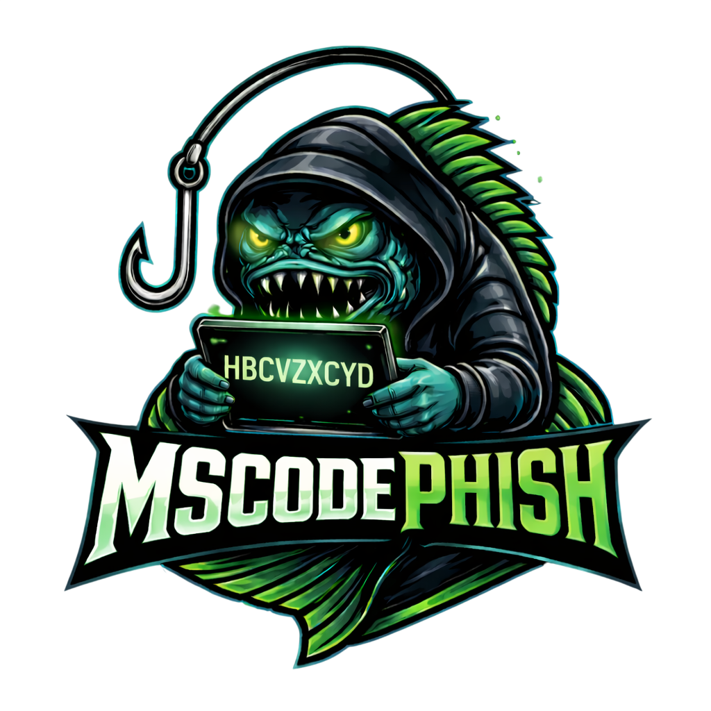

# MSCodePhish

<p align="center">
   
</p>

MSCodePhish is a red‑team toolkit that turns Microsoft’s Device Code OAuth flow into an embeddable phishing primitive that works inside any lure (e.g., “grab your coupon,” “unlock access,” etc.). Instead of pre‑generating device codes and racing against the usual 15‑minute timeout, MSCodePhish exposes a simple API endpoint that phishing pages can call via JavaScript (XHR/fetch) at the exact moment a victim opens the page. The tool then generates a fresh device code on demand, returns it to the phishing page (e.g., rendered as a “coupon code”), and instructs the user to complete the login on the legitimate Microsoft device login portal using that code.
Behind the scenes, MSCodePhish continuously polls Microsoft’s token endpoint for that device code and, once the victim finishes authentication, captures the resulting refresh token and related claims (tenant, user, etc.). From its web UI, operators can track active campaigns, monitor which lures are converting, and use captured refresh tokens to request new access tokens for different resources (ARM, Key Vault, Graph, Storage, or custom scopes) in real time. Because the code is generated only when the phishing HTML is actually loaded, MSCodePhish effectively sidesteps device‑code expiration issues and enables more realistic, flexible phishing flows that closely mimic benign “promo code” or “access code” UX patterns.
The framework is aimed at offensive security teams and researchers who want to test how easily users can be manipulated into completing the device code flow on a legitimate Microsoft page, and to demonstrate the downstream impact of a single successful device‑code phish in modern Azure/M365 environments.

---

https://github.com/user-attachments/assets/0b6a9d0a-e6f3-4518-a4b8-de81f3dbc1bb

## Features

- **Authentication & profiles**
  - Built‑in admin login (`mscodephish` is auto‑seeded on first run, password `mscodephish`).
  - Forced password change on first login.
  - Profile page to change username and password later.
- **Admin portal**
  - Dashboard, SMTP config, Azure App (Service Principal) config, campaigns, captured tokens.
- **Email delivery**
  - **SMTP**: configure one or more SMTP connections for sending phishing emails.
  - **Azure (Graph)**: optionally send phishing emails via an Azure App with `Mail.Send`.
  - Email templates support placeholders: `{{user_code}}` and `{{verification_uri}}`.
- **Device code flow**
  - Use **Microsoft public client** (no app registration) like `az login --use-device-code`.
  - Device code endpoint only needs `client_id` and `scope`; no client secret.
  - Optionally use your own Azure App / Service Principal for more control.
- **Campaigns**
  - Create campaigns with subject + HTML body; launch with a list of target emails.
  - For each target:
    - A device code session is created (user code + verification URL).
    - Optionally an email is sent with the code and link (if delivery is configured).
- **Background polling**
  - Scheduler polls Microsoft’s token endpoint for each pending device code.
  - When a victim completes login, the session status is updated and **refresh + access tokens** are stored.
- **Captured tokens**
  - View captured tokens (user, email, tenant, scope).
  - Use the **Get access token** API/UI to exchange the stored refresh token for a fresh access token.
- **Notifications**
  - Global notification settings for Slack and Discord (bot tokens + channels).
  - Per‑event toggles (session created, authorized, expired, declined, error, cancelled).

---

## Setup

1. **Requirements**

   - Python **3.8+**

2. **Install dependencies**

   ```bash
   pip install -r requirements.txt
   ```

3. **Environment (optional, but recommended)**

- Update the `.env` file in the project root (same folder as `run.py`).  

  Common settings:

  - `SECRET_KEY` – Flask secret key for sessions/CSRF.  
    - If not set, the app falls back to a weak dev key.  
    - For real use, generate a long random string (32+ chars).
  - `DATABASE_URL` – SQLAlchemy connection string. Examples:
    - `sqlite:///devicecode.db` (default; file in `instance/`)
    - `sqlite:///C:/path/to/devicecode.db`

  The app automatically loads `.env` on startup; you don’t need to export variables manually.

4. **Run the app**

   ```bash
   python run.py
   ```

   Then open `http://127.0.0.1:5000/mscodephish/login` in your browser.

---

## First-time login

On first startup, a default admin user is created:

- **Username**: `mscodephish`  
- **Password**: `mscodephish`

Flow:

1. Browse to `/mscodephish/login`.
2. Sign in with `mscodephish / mscodephish`.
3. You will immediately be redirected to **Change password**.
4. Set a new password; after that, you can use the full admin portal.

You can later rename this account and change its password from the **Profile** page.

---

## Usage overview

### 1. Device code flow

When creating a phishing campaign in the UI:

- Set the **Device code client ID** field. You can either:
  - Click a quick pick for **Azure CLI** or **PowerShell**, or
  - Paste your own public client_id (any Microsoft public client / app registration).
- This mirrors `az login --use-device-code` and the [Microsoft device code API](https://learn.microsoft.com/en-us/entra/identity-platform/v2-oauth2-device-code):
  - Uses the configured public client_id against the `organizations` tenant.
  - Only requires `client_id` and `scope`; no client secret.
  - Victims see `https://login.microsoft.com/device` (or `https://microsoft.com/devicelogin`) and the user code.

### 2. SMTP / Azure Graph (optional)

Configure how emails are sent:

- **SMTP**:
  - Host, port, TLS, from email, optional username/password.
  - Used when campaign email delivery method is set to **Use SMTP**.
- **Azure Graph**:
  - Use an Azure App with `Mail.Send` permission.
  - Configure sender (UPN or object id) and scopes.

### 3. Campaigns & templates

1. Create a campaign:
   - Choose device code config (**Microsoft public client** or Azure App).
   - Choose email delivery: **None / SMTP / Azure (Graph) / API-only**.
   - Configure subject and HTML body.
     - Supported placeholders:
       - `{{user_code}}` - the device user code.
       - `{{verification_uri}}` - the device login URL (e.g. `https://login.microsoft.com/device`).
2. Save the campaign.
3. Open the campaign detail page:
   - Paste one target email per line.
   - Click **Launch via email list**.
   - For each email:
     - A device code session is created.
     - Email is sent if email delivery is enabled and correctly configured.

### 4. Sessions & captured tokens

- The campaign detail page lists all **sessions** with:
  - Target email, source IP, user code, status, time remaining, and whether an email was sent.
- The background scheduler polls the token endpoint:
  - When successful, session status becomes **authorized** and a **CapturedToken** row is created.
- The **Captured Tokens** page shows:
  - User id, email, display name, tenant, scope, and whether a refresh token is present.
  - You can request a new access token for a chosen resource scope via the API/“Get access token” feature.

### 5. Notifications (Slack / Discord)

- Configure under **Notifications**:
  - Slack bot token + channel.
  - Discord bot token + channel ID.
  - Checkboxes for each event type you want notifications for:
    - New session created.
    - Session authorized.
    - Session expired.
    - Session declined.
    - Session error.
    - Session manually cancelled.
- Notifications are best-effort and **never break core app logic** if they fail.

---

## Legal / ethics

This toolkit is intended **only** for:

- Internal red teaming.
- Authorized penetration tests.
- Security research in lab environments.

Using it against accounts, tenants, or systems without explicit written permission may be **illegal** and unethical.  
You are responsible for complying with all applicable laws, contracts, and organizational policies.

## Legal

Use only where you have explicit authorization to conduct phishing and token capture (e.g. internal red team, authorized pentest). Unauthorized use may be illegal.


